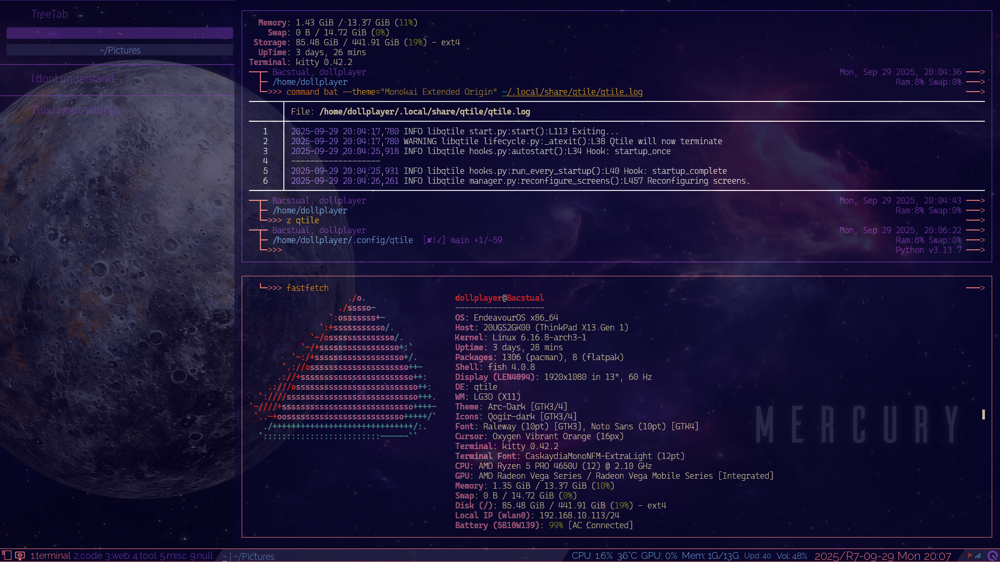

# My kitty terminal's configuration

I don't have any special settings whatsoever.  
**However**, I recommend [`cursor_trail`](https://sw.kovidgoyal.net/kitty/conf/#opt-kitty.cursor_trail). I think it adds an accent when typing.

I have installed and am using Qtile on EndeavourOS. The applications I use are listed below.

- [Qtile](https://github.com/dollplayer2501/dotfiles_qtile)
- [Starship](https://github.com/dollplayer2501/dotfiles_starship)
- The following are in private repositories:
  - Fish shell
  - Picom
  - Fastfetch
  - Bat
  - Ranger
  - LazyVim

<!-- -->
